# Forensics

### 스마트폰 디지털 포렌식을 이용한 불법촬영 판단 서비스

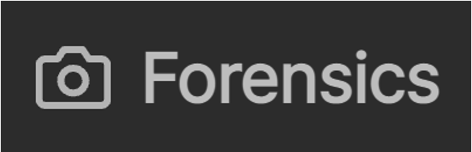

[데모 영상](https://youtu.be/xF1ewT2zeM0)

> 경희대학교 컴퓨터공학과 2024-2 캡스톤디자인 <br/>
> 개발기간: 2024.09 ~ 2024.12 <br/>
> KSC2024 논문 등재 <br/>

## 프로젝트 소개

디지털 기기, 특히 스마트폰의 사용이 일상화되며 범죄 수사에서 디지털 포렌식의 중요성이 더욱 커지고
있다. 스마트폰은 사용자의 행동, 위치 정보, 사진 및 비디오 등 다양한 데이터를 저장하고 있으며, 이러한 데 이터는 범죄 행위에 대한 증거로 활용될 수 있다. 특히 디지털 성범죄에서 스마트폰 포렌식은 중요한 수단이 되고 있다. 본 연구에서는 스마트폰 디지털 포렌식 기술을 통해 불법촬영 범죄 가능성을 판단하는 데이터를 수집하고, 수사관에게 범죄 가능성을 판단하여 제시해주며, 그 근거가 되는 데이터를 보기 쉽게 가시화하여 제공하는 서비스를 구현한다.

## 시나리오

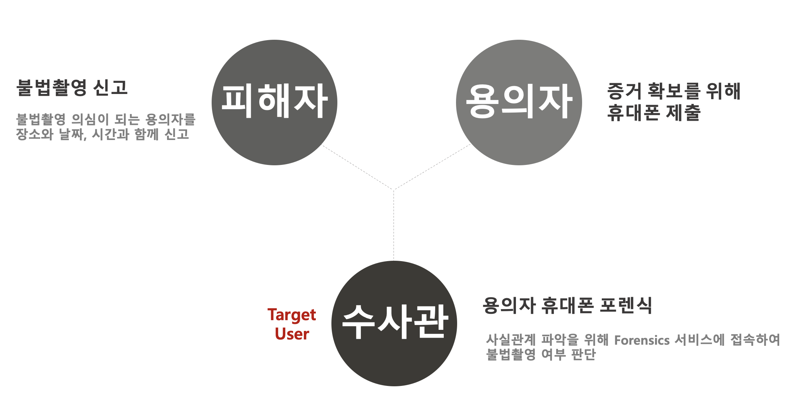

## 적용된 기술

### 1. 디지털 포렌식

- **논리적 추출**: 하드웨어가 아닌 파일 시스템에 접근하여 사용자 데이터를 추출하는 방식 채택
- **ADB(Android Debug Bridge)**: 안드로이드 스마트 폰을 관리하기 위한 개발자용 디버깅 프로그램 사용

### 2. 컴퓨터 비전

- 유해 사진 분석을 위해 Google Cloud의 Vision API 활용

## 기술 스택

### Front-end


### Back-end


### Batch


## 서비스 아키텍쳐

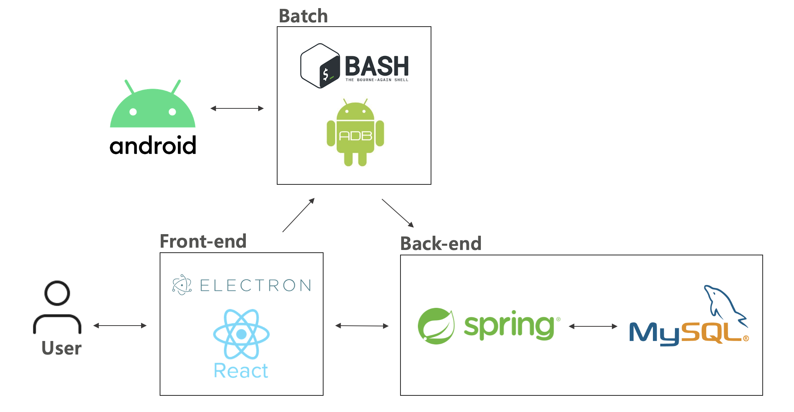

## 시작 가이드

### 요구사항

- [Node.js 20.17.0](https://nodejs.org/en)
- [Java]()
- [Kakao API KEY](https://developers.kakao.com/)
- [Kakao MAP API KEY](https://apis.map.kakao.com/)

### 설치 및 실행

**Front-end**

```sh
$ git clone https://github.com/KHU-CapstoneDesign/mobile-forensics-frontend.git
```

```sh
# 프로젝트 루트에 .env 생성 후 아래와 같이 입력
REACT_APP_KAKAO_API_KEY=***YOUR KAKAO API KEY***
REACT_APP_KAKAOMAP_API_KEY=***YOUR KAKAO MAP API KEY***
REACT_APP_API_URL="http://localhost:8080"
```

```sh
$ npm i
$ npm start
```

## 프로젝트 구조

### Front-end

```
 📦/mobile-forensics-frontend
     └📂public
      └📂images
      └📜batch
      └📜batch.bat
      └📜electron.js
      └📜index.html
      └📜preload.js
      └ ...
     └📂src
      └📂assets
      └📂components
      └📂contexts
      └📂pages
       └📜Guide.jsx
       └📜Input.jsx
       └📜Main.jsx
       └📜Picture.jsx
       └📜Result.jsx
       └ ...
      └📜App.jsx
      └📜index.js
     └📜package-lock.json
     └📜package.json
     └📜webpack.config.js
     └ ...
```

## 화면 구성

**[가이드 화면]**

 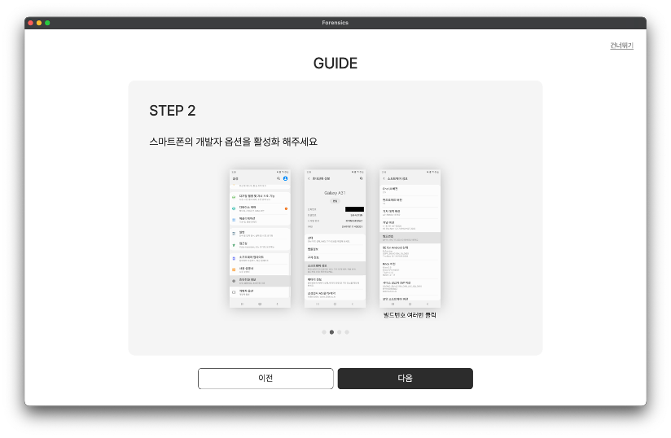
 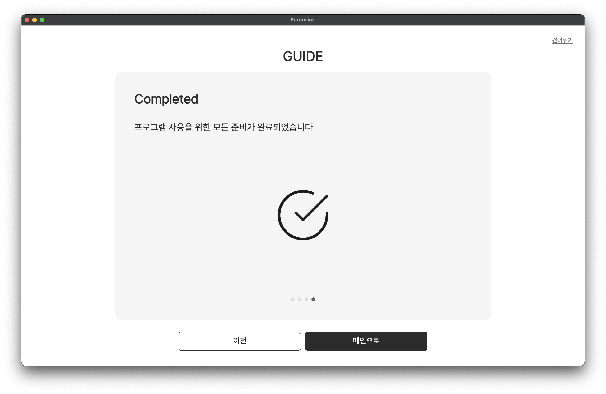

- 포렌식을 위해 사전에 설정되어야 하는 항목에 대한 가이드 제공
- 이전, 다음, 건너뛰기 가능

<br/>

**[메인 화면]**

 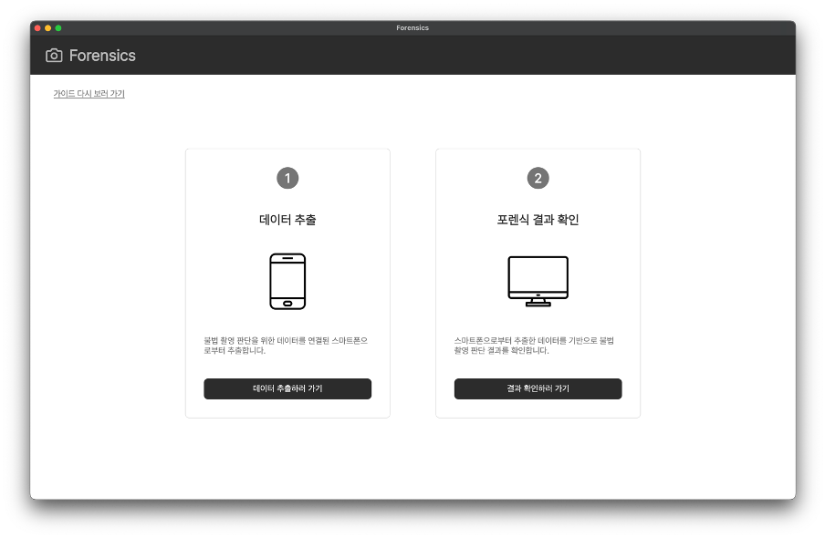

- 데이터 추출 및 포렌식 결과 확인 가능
- 네이게이션바 로고 클릭 시 메인 화면으로 이동
- 가이드 다시 보기 클릭 시 가이드 화면으로 이동

<br/>

**[데이터 추출(포렌식)]**

 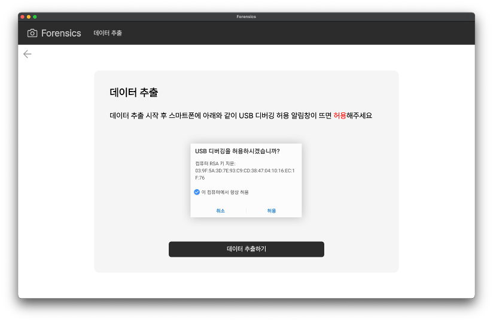
 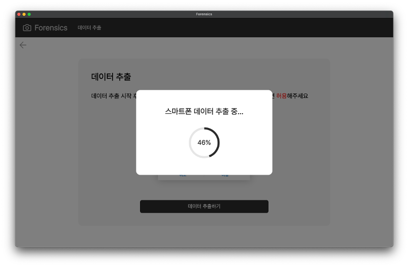

- 모달창을 통해 데이터 추출 진행 상태 확인 가능
- 데이터 추출하기 버튼 클릭 시 아래와 같이 총 6가지 데이터에 대한 **포렌식 진행 (배치파일 실행)**

<dl>
<dd>

|            데이터            |          정의          |
| :--------------------------: | :--------------------: |
|         갤러리 사진          |  1시간 이내 찍힌 사진  |
|         휴지통 사진          | 1시간 이내 삭제된 사진 |
|        사진 촬영 로그        |    1시간 이내 로그     |
| GPS(메타데이터 + wifi bssid) |     반경 50m 이내      |
|      외부 앱 접속 기록       |  1시간 이내 접속 기록  |
|           캐시파일           |  1시간 이내 캐시파일   |

</dd>
</dl>

<br/>

**[범행 정보 입력]**

 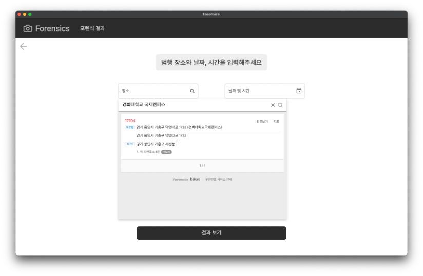
 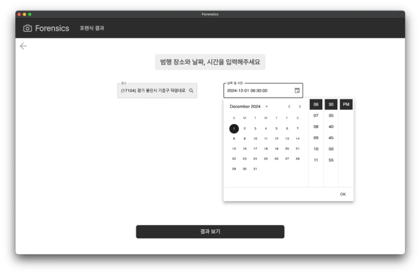

- 피해자의 증언을 토대로 한 범행 장소와 날짜 및 시간 입력
- 장소 입력을 위해 Kakao API 사용
- 지번/도로명 주소를 위도/경도로 변환하기 위해 Kakao Map API 사용
- 날짜/시간 인풋을 위해 MUI DateTimePicker 라이브러리 사용

<br/>

**[결과 화면]**

 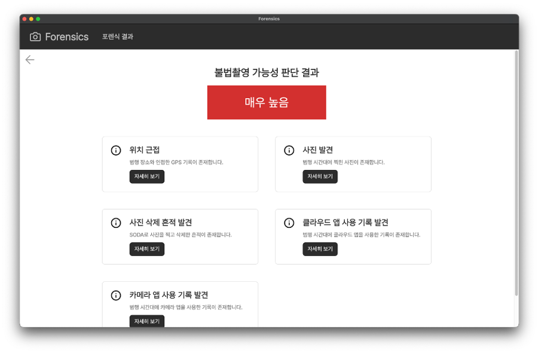

- **불법촬영 가능성 예측 판단**: 총 5단계(매우 높음/높음/보통/낮음/매우 낮음)로 분류
- **근거 데이터 제시**: 결과에 따른 근거 데이터 제시

 <br/>

**[캐시파일]**

 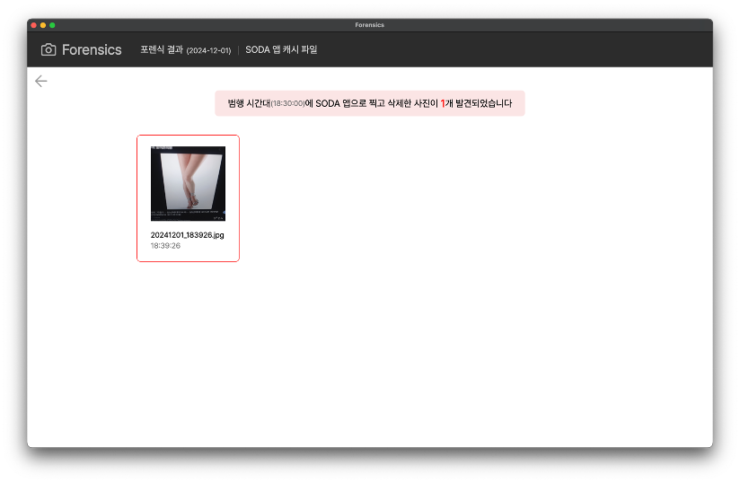
 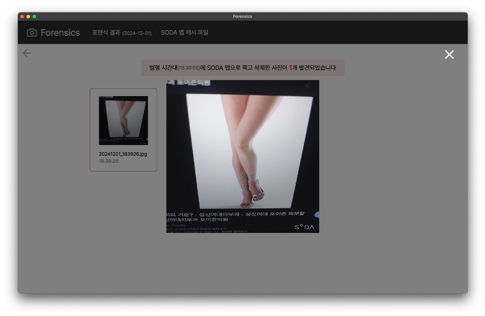

- SODA 카메라 앱으로 찍고 삭제한 사진에 대해 캐시 파일로 복구하여 범행 사진 확인 가능
- 유해 사진(범행 사진) 판단을 위해 Google Vision API 사용

 <br/>

**[갤러리/휴지통 사진]**

 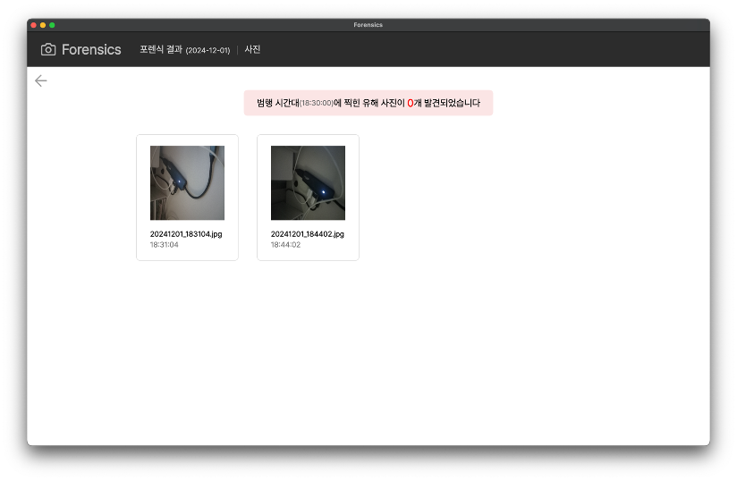
 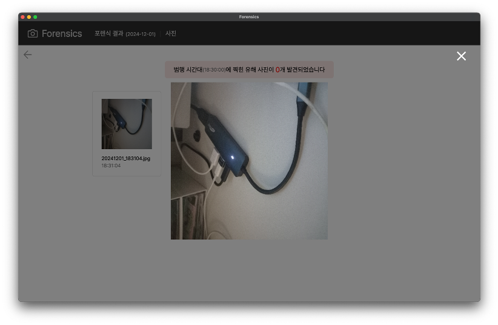

- 갤러리와 휴지통에 있는 사진 확인 가능
- 유해 사진(범행 사진) 판단을 위해 Google Vision API 사용

<br/>

**[GPS]**

 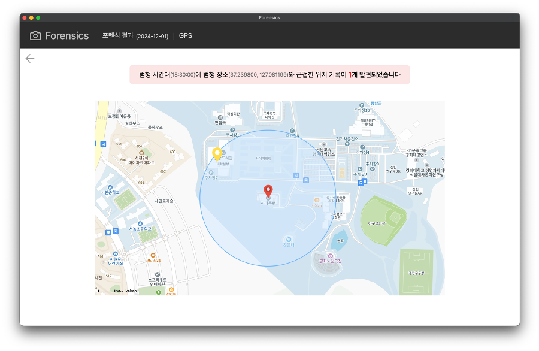

- 범행 위치로부터 반경 50m 내에 있는 위치 반환
- WIFI BSSID -> 위도, 경도 변환을 위해 Google Geolocation API 사용

<br/>

**[사진 촬영 로그]**

 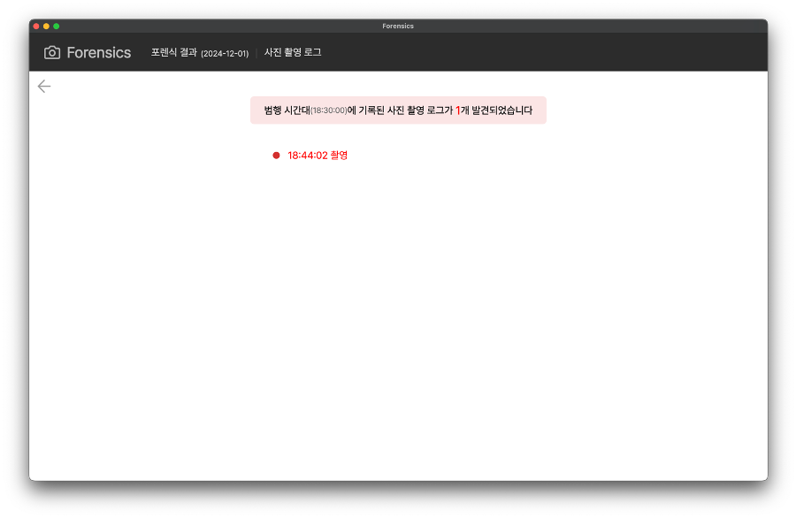

- 범행 시간대 기본 카메라 앱으로 촬영한 로그 확인 가능

 <br/>

**[앱 사용 로그]**

 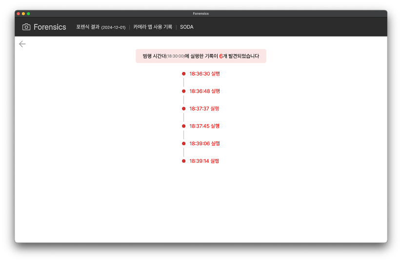
 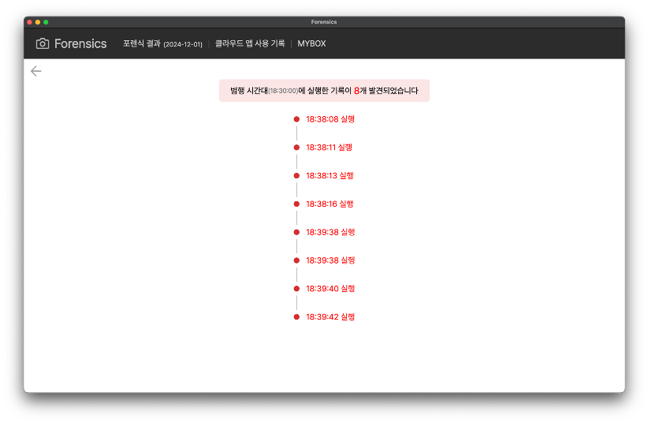

- 범행 시간대 외부 카메라 앱과 클라우드 앱의 실행 기록 확인 가능

## 역할

<div>

|                                                      **임윤희**                                                      |                                                 **홍소현**                                                  |                                                       **오수한**                                                        |
| :------------------------------------------------------------------------------------------------------------------: | :---------------------------------------------------------------------------------------------------------: | :---------------------------------------------------------------------------------------------------------------------: |
| [ <br/> @yunheeLim](https://github.com/YunheeLim) | [ <br/> @3un0ia](https://github.com/3un0ia) | [ <br/> @Kimonoduck](https://github.com/Kimonoduck) |
|                        기획, 디자인<br/>프론트엔드 개발<br/> 디지털 포렌식<br/> 배치파일 제작                        |                                                 백엔드 개발                                                 |                                            이미지 포렌식<br/> 배치파일 제작                                             |

</div>
